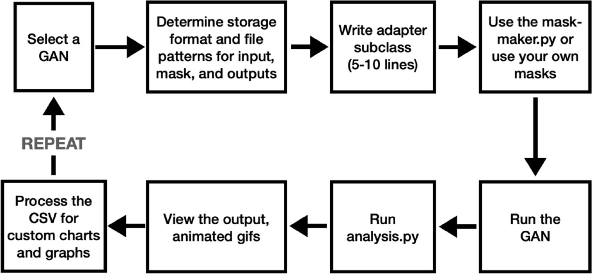

# GANBench
Library to analyze and evaluate inpainting GANs.

**Overview**

Inpainting (image repair, object removal, and image synthesis) has a long history in computer science. Early techniques used algorithmic approaches like patch finding, while the latest research leverages Generative Adversarial Networks (GANs). After studying several inpainting algorithms and literature reviews, I noticed each research team uses the same datasets. I began to wonder about the general applicability of the latest GANs. So, I set out to test these GANs on a different (but public) dataset to see how well the algorithms performed on novel images.

I found it difficult to measure GANs because each research group calculates statistics differently and the code is not always reusable. Since all GAN researchers must compare their solution to pre-existing ones, I felt other researchers have a similar problem. My solution is to create a reusable library that researchers can use to evaluate GANs. By writing a small amount of python code, different GANs can be tested and measured consistently. My solution does not make it easier to get a GAN to run, but once it is running, the effort to evaluate it is greatly simplified. Here are its features:

- Flexible. This is important because each GAN uses different ways of storing originals, masks, and generated images. For example, some GANs use masks that are bitwise-inverted from others. Some GANs require the masks to be in PNG format, while others want JPEGs. A researcher can evaluate a GAN by writing a small adapter subclass in Python. The adapter is described below.
- Statistics calculations: FID, LPIPS, and SSIM are calculated.
- Automatic generation of a PNG that is the original image with the mask translucently composited.
- Generation of an animated GIF that shows the original, the above PNG, and the generated image to make it easier to visualize the inpainting result.
- A detailed CSV file with paths to input images, masks, and output images, statistics for every image, and mean, standard deviation and variance for FID, LPIPS and SSIM. By producing a CSV, researchers can create their own charts and graphs either in a spreadsheet or in, say, Jupyter Notebook.

**Organization of the files:**

1. Assignments folder, which contains various documents from my semester course at Columbia including the Final Report, from which I took some text to make this README.
2. A collection of python files:

**How to use the code:**

- `Adapter.py` bridges GAN code with the mask-maker and analysis components. I provide a base class with functionality already implemented. I determined the necessary class methods by evaluating three different GANs.

- `Mask-maker.py` is responsible for assigning masks to input images. For the Open Images dataset, a subset of the validation images includes segmentation masks. The mask maker filters the validation image list to those images with masks because only images with valid segmentation masks are appropriate for this object removal test. It also composites multiple segmentation masks if more than one is present for an image (this happens if more than one object was identified and masked). It will resize the original image if the GAN has specific image size requirements, it will resize the mask to match the original image’s size, and it will invert the mask if the GAN requires it. The final output of the mask-maker is a set of directories: the input directory, the mask direc-tory, and a directory of mask visualizations so researchers can see what will be inpainted before running the GAN. These directories can then be fed into the GAN without modifying it because the files and formats match the GAN’s requirements.

- `Analysis.py` is used after the GAN has been executed. The analysis code creates an animated GIF of the re-pair, showing the original image, the mask composited on top of it, and the repaired image. It also calculates the three statistics (LPIPS, SSIM, and FID). Finally, it outputs a CSV. At the top of the CSV are combined statistics such as LPIPS mean and standard deviation (and FID, which is a single number for the entire dataset). Then there are a series of rows, with the paths to the files and the calculated statistics for each input image. By pro-cessing the CSV, researchers can create their own charts and graphs that meet their needs.

**Links**
- MI-GAN and CoModGAN: [https://github.com/Picsart-AI-Research/MI-GAN](url)
- HiFill: [https://github.com/Atlas200dk/sample-imageinpainting-HiFill](url)
- Open Images v7: : [https://storage.googleapis.com/openimages/web/download_v7.html](url)
